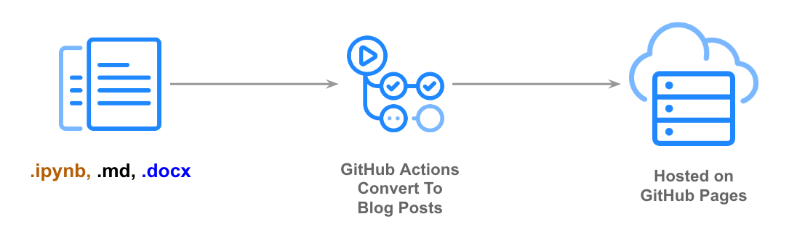

   [](https://fastai.github.io/fastpages/)

# Welcome To `fastpages`

> An easy to use blogging platform, with support for Jupyter notebooks, Word docs, and Markdown.



`fastpages` uses [GitHub Actions](https://github.com/features/actions) to simplify the process of of creating [Jekyll blog posts](https://jekyllrb.com/) on [GitHub Pages](https://pages.github.com/) from a variety of input formats.

### `fastpages` contain **special features for Jupyter Notebooks**, such as:

- Interactive visualizations made with [Altair](https://altair-viz.github.io/) remain interactive.
- Ability to **hide cells** (input, output or both).
- Ability to have **collapsable code cells** that are either open or closed by default.
- Embed **Twitter cards** and **YouTube videos**.
- Ability to add **[Colab](https://colab.research.google.com/)** and View on **GitHub badges** automatically.
- Include **banners** such as warnings, tooltips, etc.
- Define the Title, Summary and other metadata for your blog post via a special markdown cell.
- The notebook to blog conversion is powered by `nbdev`, which is under active development.  Check the [nbdev docs](https://nbdev.fast.ai/), particularly the [export2html](https://nbdev.fast.ai/export2html/) section, for a complete list of features that may be useful for notebooks.

_See the [this section](#Writing-Blog-Posts-With-Jupyter) below for more details on how to configure these features._


**[See the demo site](https://fastai.github.io/fastpages/)**

---

<!-- TOC depthFrom:1 depthTo:6 withLinks:1 updateOnSave:1 orderedList:0 -->

- [Welcome To `fastpages`](#welcome-to-fastpages)
	- [Setup Instructions](#setup-instructions)
	- [Writing Blog Posts With Jupyter](#writing-blog-posts-with-jupyter)
      - [Configure Title & Summary](#configure-title-summary)
      - [Table of Contents](#table-of-contents)
      - [Colab & GitHub Badges](#colab-github-badges)
      - [Enabling Comments](#enabling-comments)
      - [Hide Input/Output Cells](#hide-inputoutput-cells)
      - [Collapsable Code Cells](#collapsable-code-cells)
      - [Embedded Twitter and YouTube Content](#embedded-twitter-and-youtube-content)
      - [Automatically Convert Notebooks To Blog Posts](#automatically-convert-notebooks-to-blog-posts)
	- [Writing Blog Posts With Markdown](#writing-blog-posts-with-markdown)
	- [Writing Blog Posts With Microsoft Word](#writing-blog-posts-with-microsoft-word)
	- [Using The GitHub Action & Your Own Custom Blog](#using-the-github-action-your-own-custom-blog)
		- [Optional Inputs](#optional-inputs)
- [Contributing To Fastpages](#contributing-to-fastpages)
- [FAQ](#faq)
- [Acknowledgements](#acknowledgements)

<!-- /TOC -->


## Setup Instructions

1. Click the [](https://github.com/fastai/fastpages/generate) button to create a copy of this repo in your account. 

2. Change the badges on this README to point to your repository instead of this one.  For example, instead of 

    ``

    this would be

    ``

3. Change `baseurl:` in `_config.yaml` to the name of your repository. For example, instead of 

    `baseurl: "/fastpages"`

    this would be

    `baseurl: "/your-repo-name"`

4. Similarly, change the `url:` parameter in `_config.yaml` to the url your blog will be served on.  For exmaple, instead of

    `url: "https://fastai.github.io"`

    this might be 

    `url: "https://<your-user-name>.github.io"`

5. Read through `_config.yaml` carefully as there may be other options that must be set.  The comments in this file will provide instructions. 

6. [Follow these instructions to create an ssh-deploy key](https://developer.github.com/v3/guides/managing-deploy-keys/#deploy-keys).  Make sure you **select Allow write access** when adding this key to your GitHub account.

7. [Follow these instructions to upload your deploy key](https://help.github.com/en/actions/configuring-and-managing-workflows/creating-and-storing-encrypted-secrets#creating-encrypted-secrets) as an encrypted secret on GitHub.  Make sure you name your key `SSH_DEPLOY_KEY`.

8. Go to your [repository settings and enable GitHub Pages](https://help.github.com/en/enterprise/2.13/user/articles/configuring-a-publishing-source-for-github-pages) on your `gh-pages` branch.


## Writing Blog Posts With Jupyter

Create a markdown cell at the beginning of the notebook with the following contents:

  ```markdown
  # Title
  > Awesome summary
  - toc: false
  - branch: master
  - badges: true
  - comments: true
  - metadata_key1: metadata_value1
  - metadata_key2: metadata_value2
  ```

Additional metadata is optional and allows you to set custom [front matter](https://jekyllrb.com/docs/front-matter/).

### Configure Title & Summary
  - Replace `Title`, with your desired title, and `Awesome summary` with your desired summary. 

### Table of Contents
  - `fast_template` will automatically generate a table of contents for you based on [markdown headers](https://guides.github.com/features/mastering-markdown/)!  You can toggle this feature on or off by setting `toc:` to either `true` or `false`.

### Colab & GitHub Badges
  -  The `branch` field is used to optionally render a link your notebook to Colab and GitHub in your blog post post. It'll default to `master` if you don't specify it in the notebook.
  - If you do not want to show Colab / GitHub badges on your blog post (perhaps because your repo is private and the links would be broken) set `badges` to `false`.  This defaults to `true`

### Enabling Comments

Blog posting is powered by [Utterances](https://github.com/utterance/utterances), an open-source and ad-free way of implementing comments.  All comments are stored in issues on your blog's GitHub repo.  You can turn this on setting `comments` to  `true`.  This defaults to `false`.

To enable comments with [Utterances](https://github.com/utterance/utterances) you will need to do the following:

  - Make sure the repo is public, otherwise your readers will not be able to view the issues/comments.
  - Make sure the [utterances app](https://github.com/apps/utterances) is installed on the repo, otherwise users will not be able to post comments.
  - If your repo is a fork, navigate to it's settings tab and confirm the issues feature is turned on.

### Hide Input/Output Cells

Place the comment `#hide` at the beginning of a code cell and it wil **hide both the input and the output** of that cell. If you only want to hide just the input or the output, use the `hide input` [Jupyter Extension](https://jupyter-contrib-nbextensions.readthedocs.io/en/latest/nbextensions/hide_input/readme.html)

### Collapsable Code Cells

You may want to have code code be hidden from view under a collapsed element that the user can expand, rather than completely hiding the code from the reader.  

- To include code in a collapsable cell that **is collapsed by default**, place the comment `#collapse` at the top of the code cell.
- To include code in a collapsable cell that **is open by default**, place the comment `#collapse_show` or `#collapse-show` at the top of the code cell.

### Embedded Twitter and YouTube Content
In a markdown cell in your notebook, use the following markdown shortcuts to embed Twitter cards and YouTube Videos.


  ```markdown
  > youtube: https://youtu.be/your-link
  > twitter: https://twitter.com/some-link
  ```

### Automatically Convert Notebooks To Blog Posts

1. Save your notebook with the naming convention `YYYY-MM-DD-*.` into the `/_notebooks` or `/_word` folder of this repo, respectively.  For example `2020-01-28-My-First-Post.ipynb`.  This [naming convention is required by Jekyll](https://jekyllrb.com/docs/posts/) to render your blog post.
    - Be careful to name your file correctly!  It is easy to forget the last dash in `YYYY-MM-DD-`. Furthermore, the character immediately following the dash should only be an alphabetical letter.  Examples of valid filenames are:

        ```shell
        2020-01-28-My-First-Post.ipynb
        2012-09-12-how-to-write-a-blog.ipynb
        ```

     - If you fail to name your file correctly, `fastpages` will automatically attempt to fix the problem by prepending the last modified date of your file to your generated blog post, however, it is recommended that you name your files properly yourself for more transparency.


2. [Commit and push](https://help.github.com/en/github/managing-files-in-a-repository/adding-a-file-to-a-repository-using-the-command-line) your file(s) to GitHub in your repository's master branch.

3. GitHub will automatically convert your files to blog posts.  You can click on the Actions tab of your repo to view the logs of this process.

4. If you wish, you can preview how your blog will look locally before commiting to GitHub.  If you wish to do so, please see the [development guide](_dev_tools/README.md).


## Writing Blog Posts With Markdown

If you are writing your blog post in markdown, save your `.md` file into the `/_posts` folder with the same naming convention (`YYYY-MM-DD-*.md`) specified for notebooks.

## Writing Blog Posts With Microsoft Word

Save your Microsoft Word documents into the `/_word` folder with the same naming convention (`YYYY-MM-DD-*.docx`) specified for notebooks.

## Using The GitHub Action & Your Own Custom Blog

The `fastpages` action allows you to convert notebooks from `/_notebooks` and word documents from `/_word` directories in your repo into [Jekyll](https://jekyllrb.com/) compliant blog post markdown files located in `/_posts`.  **Note: This directory structure is currently inflexible** for this Action, as it is designed to be used with Jekyll.

If you already have sufficient familiarity with [Jekyll](https://jekyllrb.com/) and wish to use this automation in your own theme,  you can use this GitHub Action by referencing `fastai/fastpages@master` as follows:

```yaml
...

uses: fastai/fastpages@master

...
```
An illustrative example of what a complete workflow may look like:


```yaml
jobs:
  build-site:
    runs-on: ubuntu-latest
    ...

    - name: convert notebooks and word docs to posts
      uses: fastai/fastpages@master

    ...

    - name: Jekyll build
      uses: docker://jekyll/jekyll
      with:
        args: jekyll build

    - name: Deploy
      uses: peaceiris/actions-gh-pages@v2
      if: github.event_name == 'push'
      env:
        ACTIONS_DEPLOY_KEY: ${{ secrets.SSH_DEPLOY_KEY }}
        PUBLISH_BRANCH: gh-pages
        PUBLISH_DIR: ./_site
```

Note that this Action **does not have any required inputs, and has no output variables**.  

### Optional Inputs

  - `BOOL_SAVE_MARKDOWN`:  Either 'true' or 'false'.  Whether or not to commit converted markdown files from notebooks and word documents into the _posts directory in your repo.  This is useful for debugging. _default: false_
  - `SSH_DEPLOY_KEY`: a ssh deploy key is required if BOOL_SAVE_MARKDOWN = 'true'

See the API spec for this action in [action.yml](action.yml)

Detailed instructions on how to customize this blog are beyond the scope of this README.  ( We invite someone from the community to contribute a blog post on how to do this in this repo! )

# Contributing To Fastpages

Please see the [development guide](_dev_tools/README.md).


# FAQ

- **Q:** Where are the markdown files in `_posts/` that are generated from my Jupyter notebooks or word documents?  **A:** The GitHub Actions workflow in this repo converts your notebook and word documents to markdown on the fly before building your site, but never commits these intermediate markdown files to this repo.  This is in order to save you from the annoyance of your local environment being constantly out of sync with your repository.  You can optionally see these intermediate markdown files by setting the `BOOL_SAVE_MARKDOWN` and `SSH_DEPLOY_KEY` inputs to the fastpages action in your `.github/workflows/ci.yaml` file as follows:

```yaml
    ...

    - name: convert notebooks and word docs to posts
      uses: fastai/fastpages@master
      with:
        BOOL_SAVE_MARKDOWN: true
        SSH_DEPLOY_KEY: ${{ secrets.SSH_DEPLOY_KEY }}

    ...
```

# Acknowledgements

- [Nate Gadzhibalaev](https://github.com/xnutsive): We ported his excellent work on [#14](https://github.com/fastai/fast_template/pull/14) from [fast_template](https://github.com/fastai/fast_template) to this repo, which enabled many features.
- All the contributors to [nbdev](https://github.com/fastai/nbdev), which powers many of the features in this repo.
