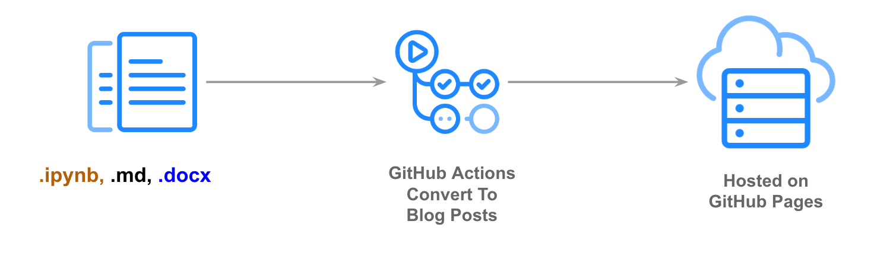
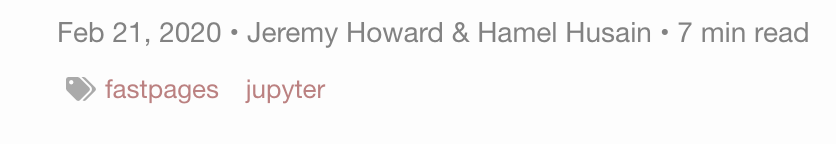

[//]: # (BADGES SECTION: change `fastai` with your GitHub username and `fastpages` with the name of your repo)


[![](https://img.shields.io/static/v1?label=fastai&message=nbdev&color=57aeac&labelColor=black&style=flat&logo=data:image/png;base64,iVBORw0KGgoAAAANSUhEUgAAABkAAAAjCAYAAABhCKGoAAAGMklEQVR42q1Xa0xTVxyfKExlui9blszoB12yDzPGzJhtyT5s+zBxUxELBQSHm2ZzU5epBF/LclXae29pCxR5VEGgLQUuIOKDuClhm8oUK7S9ve19tLTl/fA5p9MNc/Y/hRYEzGLxJL/87zk9Ob/zf5++NGHMALzYgdDYmWh0Qly3Lybtwi6lXdpN2cWN5A0+hrQKe5R2PoN2uD+OKcn/UF5ZsVduMmyXVRi+jzebdmI5/juhwrgj3mTI2GA0vvsUIcMwM7GkOD42t7Mf6bqHkFry2yk7X5PXcxMVDN5DGtFf9NkJfe6W5iaUyFShjfV1KPlk7VPAa0k11WjzL+eRvMJ4IKQO0dw8SydJL+Op0u5cn+3tQTn+fqTivTbQpiavF0iG7iGt6NevKjpKpTbUo3hj+QO47XB8hfHfIGAelA+T6mqQzFi+e0oTKm3iexQnXaU56ZrK5SlVsq70LMF7TuX0XNTyvi1rThzLST3TgOCgxwD0DPwDGoE07QkcSl/m5ynbHWmZVm6b0sp9o2DZN8aTZtqk9w9b2G2HLbbvsjlx+fry0vwU0OS5SH68Ylmilny3c3x9SOvpRuQN7hO8vqulZQ6WJMuXFAzcRfkDd5BG8B1bpc+nU0+fQtgkYLIngOEJwGt/J9UxCIJg1whJ05Ul4IMejbsLqUUfOjJKQnCDr4ySHMeO1/UMIa3UmR9TUpj7ZdMFJK8yo6RaZjLAF/JqM/rifCO+yP4AycGmlgUaT9cZ0OYP2um5prjBLhtvLhy68Fs7RFqbRvSlf15ybGdyLcPJmcpfIcIuT4nqqt+Sa2vaZaby1FB+JGi1c9INhuiv9fpIysItIh3CVgVAzXfEE1evzse/bwr8bolcAXs+zcqKXksQc5+FD2D/svT06I8IYtaUeZLZzsVm+3oRDmON1Ok/2NKyIJSs0xnj84RknXG6zgGEE1It+rsPtrYuDOxBKAJLrO1qnW7+OpqeNxF4HWv6v4Rql3uFRvL/DATnc/29x4lmy2t4fXVjY+ASGwylm8DBvkSm2gpgx1Bpg4hyyysqVoUuFRw0z8+jXe40yiFsp1lpC9navlJpE9JIh7RVwfJywmKZO4Hkh02NZ1FilfkJLi1B4GhLPduAZGazHO9LGDX/WAj7+npzwUQqvuOBoo1Va91dj3Tdgyinc0Dae+HyIrxvc2npbCxlxrJvcW3CeSKDMhKCoexRYnUlSqg0xU0iIS5dXwzm6c/x9iKKEx8q2lkV5RARJCcm9We2sgsZhGZmgMYjJOU7UhpOIqhRwwlmEwrBZHgCBRKkKX4ySVvbmzQnXoSDHWCyS6SV20Ha+VaSFTiSE8/ttVheDe4NarLxVB1kdE0fYAgjGaOWGYD1vxKrqmInkSBchRkmiuC4KILhonAo4+9gWVHYnElQMEsAxbRDSHtp7dq5CRWly2VlZe/EFRcvDcBQvBTPZeXly1JMpvlThzBBRASBoDsSBIpgOBQV6C+sUJzffwflQX8BTevCTZMZeoslUo9QJJZYTZDw3RuIKtIhlhXdfhDoJ7TTXY/XdBBpgUshwFMSRYTVwim7FJvt6aFyOnoVKqc7MZQDzzNwsmnd3UegCudl8R2qzHZ7bJbQoYGyn692+zMULCfXenoOacTOTBUnJYRFsq+5+a3sjp5BXM6hEz7ObHNoVEIHyocekiX6WIiykwWDd1HhzT8RzY2YqxnK0HNQBJtW500ddiwrDgdIeCABZ4MPnKQdk9xDhUP3wfHSqbBI9v/e9jo0Iy30cCOgAMyVgMMVCMwql/cQxfKp2R1dWWrRm0PzUkrIXC9ykDY+hnJ5DqkE709guriwSRgGzWTQCPABWJZ6vbNHQlgo099+CCEMPnF6xnwynYETEWd8ls0WPUpSWnTrfuAhAWacPslUiQRNLBGXFSA7TrL8V3gNhesTnLFY0jb+bYWVp0i7SClY184jVtcayi7so2yuA0r4npbjsV8CJHZhPQ7no323cJ5w8FqpLwR/YJNRnHs0hNGs6ZFw/Lpsb+9oj/dZSbuL0XUNojx4d9Gch5mOT0ImINsdKyHzT9Muz1lcXhRWbo9a8J3B72H8Lg6+bKb1hyWMPeERBXMGRxEBCM7Ddfh/1jDuWhb5+QkAAAAASUVORK5CYII=)](https://github.com/fastai/nbdev)
[](https://fastpages.fast.ai/)

[//]: # (END OF BADGES SECTION)

# Welcome To `fastpages`

> An easy to use blogging platform, with support for Jupyter notebooks, Word docs, and Markdown.



`fastpages` uses [GitHub Actions](https://github.com/features/actions) to simplify the process of of creating [Jekyll blog posts](https://jekyllrb.com/) on [GitHub Pages](https://pages.github.com/) from a variety of input formats.

### `fastpages` provides the following features:

- Create posts containing code, outputs of code (which can be interactive), formatted text, etc directly from [Jupyter Notebooks](https://jupyter.org/); Notebook posts support features such as:
    - Interactive visualizations made with [Altair](https://altair-viz.github.io/) remain interactive.
    - Hide or show cell input and output.
    - Collapsable code cells that are either open or closed by default.
    - Define the Title, Summary and other metadata via a special markdown cells
    - Ability to add links to [Colab](https://colab.research.google.com/) and GitHub automatically.
- Write posts on your local machine and [preview them with live reload](#running-the-blog-on-your-local-machine).
- Create posts, including formatting and images, directly from Microsoft Word documents.
- Create and edit [Markdown](https://guides.github.com/features/mastering-markdown/) posts entirely online using GitHub's built-in markdown editor.
- Embed Twitter cards and YouTube videos.
- Categorization of blog posts by user-supplied tags for discoverability.

See below for a more detailed list of features.


**[See the demo site](https://fastpages.fast.ai/)**

---

<!-- TOC depthFrom:1 depthTo:6 withLinks:1 updateOnSave:1 orderedList:0 -->

- [Welcome To `fastpages`](#welcome-to-fastpages)
	- [Setup Instructions](#setup-instructions)
	- [Customizing Blog Posts With Front Matter](#customizing-blog-posts-with-front-matter)
		- [Configure Title & Summary](#configure-title--summary)
		- [Table of Contents](#table-of-contents)
		- [Colab And GitHub Badges](#colab-and-github-badges)
		- [Tags](#categories)
		- [Enabling Comments](#enabling-comments)
		- [Setting an Image For Social Media](#setting-an-image-for-social-media)
  - [Site Wide Configuration Options](#site-wide-configuration-options)
  - [Writing Blog Posts With Jupyter](#writing-blog-posts-with-jupyter)
	  - [Hide Input/Output Cells](#hide-inputoutput-cells)
	  - [Collapsable Code Cells](#collapsable-code-cells)
	  - [Embedded Twitter and YouTube Content](#embedded-twitter-and-youtube-content)
	  - [Automatically Convert Notebooks To Blog Posts](#automatically-convert-notebooks-to-blog-posts)
  - [Writing Blog Posts With Markdown](#writing-blog-posts-with-markdown)
  - [Writing Blog Posts With Microsoft Word](#writing-blog-posts-with-microsoft-word)
- [Running the blog on your local machine](#running-the-blog-on-your-local-machine)
- [Using The GitHub Action & Your Own Custom Blog](#using-the-github-action-your-own-custom-blog)
	- [Optional Inputs](#optional-inputs)
- [Contributing To Fastpages](#contributing-to-fastpages)
- [Upgrading Fastpages](#upgrading-fastpages)
- [Customizing Fastpages](#customizing-fastpages)
- [FAQ](#faq)

<!-- /TOC -->


## Setup Instructions

1.  Generate a copy of this repo by clicking [on this link](https://github.com/fastai/fastpages/generate).  Name your repo anything you like **except** {your-username}.github.io.

2. **GitHub Actions will automatically open a PR** on your new repository ~ 30 seconds after the copy is created.  Follow the instructions in that PR to continue.

For a live walk-through of the setup steps (with some additional tips) see this [video tutorial of setting up a fastpages blog](https://youtu.be/L0boq3zqazI) by Abdul Majed.


## Customizing Blog Posts With Front Matter

[Front matter](https://jekyllrb.com/docs/front-matter/) allows you to toggle various options on/off for each blog post, as well as pass metadata to various features of fastpages.

In a notebook, front matter is defined as a markdown cell at the beginning of the notebook with the following contents:

  ```markdown
  # "Title"
  > "Awesome summary"
  - toc: false
  - branch: master
  - badges: true
  - comments: true
  - categories: [fastpages, jupyter]
  - image: images/some_folder/your_image.png
  - metadata_key1: metadata_value1
  - metadata_key2: metadata_value2
  ```

Similarly, in a markdown document the same front matter would be defined like this at the beginning of the document:

  ```yaml
  ---
  title: "My Title"
  summary: "Awesome summary"
  toc: false
  comments: true
  image: images/some_folder/your_image.png
  categories: [fastpages, jupyter]
  metadata_key1: metadata_value1
  metadata_key2: metadata_value2
  ---
  ```

Additional metadata is optional and allows you to set custom [front matter](https://jekyllrb.com/docs/front-matter/).  

Note that anything defined in front matter must be valid YAML.  **Failure to provide valid YAML could result in your page not rendering** in your blog.  For example, if you want a colon in your title you must escape it with double quotes like this:

` - title: "Deep learning: A tutorial"`

See this [tutorial on YAML](https://rollout.io/blog/yaml-tutorial-everything-you-need-get-started/) for more information.

### Configure Title & Summary
  - Replace `Title`, with your desired title, and `Awesome summary` with your desired summary.

**Note:** It is recommended to enclose these values in double quotes, so that you can escape colons and other characters that may break the YAML parser.

### Table of Contents
  - `fast_template` will automatically generate a table of contents for you based on [markdown headers](https://guides.github.com/features/mastering-markdown/)!  You can toggle this feature on or off by setting `toc:` to either `true` or `false`.

### Colab And GitHub Badges

This option works for **notebooks only**

  -  The `branch` field is used to optionally render a link your notebook to Colab and GitHub in your blog post post. It'll default to `master` if you don't specify it in the notebook.
  - If you do not want to show Colab / GitHub badges on your blog post (perhaps because your repo is private and the links would be broken) set `badges` to `false`.  This defaults to `true`

### Categories
  - You can have a comma seperated list inside square brackets of categories for a blog post, which will make the post visible on the tags page of your blog's site.  For example:

    In a notebook:
    
    ```
    # "My Title"
    - categories: [fastpages, jupyter]
    ```

    In a markdown document:

    ```
    ---
    title: "My Title"
    categories: [fastpages, jupyter]
    ---
    ```

  You can see a preview of what this looks like [here](https://fastpages.fast.ai/categories/).


  - You can toggle the display of tags on/off by setting `show_tags` to `true` or `false` in `_config.yml`:

```yaml
# Set this to true to display tags on each post
show_tags: true
```

### Enabling Comments

Blog posting is powered by [Utterances](https://github.com/utterance/utterances), an open-source and ad-free way of implementing comments.  All comments are stored in issues on your blog's GitHub repo.  You can turn this on setting `comments` to  `true`.  This defaults to `false`.

To enable comments with [Utterances](https://github.com/utterance/utterances) you will need to do the following:

  - Make sure the repo is public, otherwise your readers will not be able to view the issues/comments.
  - Make sure the [utterances app](https://github.com/apps/utterances) is installed on the repo, otherwise users will not be able to post comments.
  - If your repo is a fork, navigate to it's settings tab and confirm the issues feature is turned on.

### Setting an Image For Social Media

On social media sites like Twitter, an image preview can be automatically shown with your URL.  Specifying the front matter `image` provides this metadata to social media sites to render this image for you.  You can set this value as follows:

`- image: images/diagram.png`

Note: for this setting **you can only reference image files and folders in the `/images` folder of your repo.**

## Site Wide Configuration Options

**It is recommended that everyone personalizes their blogging site by setting site-wide configration options**. These options can be found in `/_config.yml`.  Below is a description of various options that are available.

- `title`: this is the title that appears on the upper left hand corner on the header of all your pages.  
- `description`: this description will show up in various places when a preview for your site is generated (for example, on social media).
- `github_username`: this allows your site to display a link to your GitHub page in the foooter.
- `github_repo`: this allows your site to render links back to your repository for various features such as links to GitHub and Colab for notebooks.
- `url`: This does not need to be changed unless you have a custom domain.  **Note: leave out the trailing / from this value.**
- `baseurl`: See the comments in `/_config.yml` for instructions ( "Special Instructions for baseurl" on setting this value properly.  If you do not have a custom domain, then you can likely ignore this option.
- `email`: this is currently unused.  Ignore.
- `twitter_username`: creates a link in your footer to your twitter page.
- `use_math`: Set this to `true` to get LaTeX math equation support.  This is off by default as it otherwhise loads javascript into each page that may not be used.
- `show_description`: This shows a description under the title of your blog posts on your homepage that contains a list of your blog posts.  Set to `true` by default.
- `google_analytics`: Optionally use a [Google Analytics](http://www.google.com/analytics/) ID for tracking if desired. 
- `show_image`: If set to true, this uses the `image` parameter in the front matter of your blog posts to render a preview of your blogs as shown below.  This is set to `false` by default.
  When show_image is set to `true` your homepage will look like this:

  

- `show_tags`: You can toggle the display of tags on your blog posts on or off by setting this value to `false`.  This is set to `true` by default, which which renders the following links for tags on your blog posts like this:




## Writing Blog Posts With Jupyter

### Hide Input/Output Cells

Place the comment `#hide` at the beginning of a code cell and it wil **hide both the input and the output** of that cell. 

A `#hide_input` comment at the top of any cell will **only hide the input**.

Furthermore, the `hide input` [Jupyter Extension](https://jupyter-contrib-nbextensions.readthedocs.io/en/latest/nbextensions/hide_input/readme.html) can be used to hide cell inputs or outputs, which will be respected by fastpages.

### Collapsable Code Cells

You may want to have code code be hidden from view under a collapsed element that the user can expand, rather than completely hiding the code from the reader.  

- To include code in a collapsable cell that **is collapsed by default**, place the comment `#collapse` at the top of the code cell.
- To include code in a collapsable cell that **is open by default**, place the comment `#collapse_show` or `#collapse-show` at the top of the code cell.

### Embedded Twitter and YouTube Content
In a markdown cell in your notebook, use the following markdown shortcuts to embed Twitter cards and YouTube Videos.


  ```markdown
  > youtube: https://youtu.be/your-link
  > twitter: https://twitter.com/some-link
  ```

### Automatically Convert Notebooks To Blog Posts

1. Save your notebook with the naming convention `YYYY-MM-DD-*.` into the `/_notebooks` or `/_word` folder of this repo, respectively.  For example `2020-01-28-My-First-Post.ipynb`.  This [naming convention is required by Jekyll](https://jekyllrb.com/docs/posts/) to render your blog post.
    - Be careful to name your file correctly!  It is easy to forget the last dash in `YYYY-MM-DD-`. Furthermore, the character immediately following the dash should only be an alphabetical letter.  Examples of valid filenames are:

        ```shell
        2020-01-28-My-First-Post.ipynb
        2012-09-12-how-to-write-a-blog.ipynb
        ```

     - If you fail to name your file correctly, `fastpages` will automatically attempt to fix the problem by prepending the last modified date of your file to your generated blog post, however, it is recommended that you name your files properly yourself for more transparency.


2. [Commit and push](https://help.github.com/en/github/managing-files-in-a-repository/adding-a-file-to-a-repository-using-the-command-line) your file(s) to GitHub in your repository's master branch.

3. GitHub will automatically convert your files to blog posts.  **It will take ~5 minutes for the conversion process to take place**.  You can click on the Actions tab of your repo to view the logs of this process. There will be two workflows that are triggered with each push you make to your master branch: (1) "CI" and (2) "GH Pages Status".  Both workflows must complete with a green checkmark for your latest commit before your site is updated.

4. If you wish, you can preview how your blog will look locally before commiting to GitHub. See [this section](#running-the-blog-on-your-local-machine) for a detailed guide on running the preview locally.


## Writing Blog Posts With Markdown

If you are writing your blog post in markdown, save your `.md` file into the `/_posts` folder with the same naming convention (`YYYY-MM-DD-*.md`) specified for notebooks.

## Writing Blog Posts With Microsoft Word

Save your Microsoft Word documents into the `/_word` folder with the same naming convention (`YYYY-MM-DD-*.docx`) specified for notebooks.

# Running the blog on your local machine

See the [development guide](_fastpages_docs/DEVELOPMENT.md).


# Using The GitHub Action & Your Own Custom Blog

The `fastpages` action allows you to convert notebooks from `/_notebooks` and word documents from `/_word` directories in your repo into [Jekyll](https://jekyllrb.com/) compliant blog post markdown files located in `/_posts`.  **Note: This directory structure is currently inflexible** for this Action, as it is designed to be used with Jekyll.

If you already have sufficient familiarity with [Jekyll](https://jekyllrb.com/) and wish to use this automation in your own theme,  you can use this GitHub Action by referencing `fastai/fastpages@master` as follows:

```yaml
...

uses: fastai/fastpages@master

...
```
An illustrative example of what a complete workflow may look like:


```yaml
jobs:
  build-site:
    runs-on: ubuntu-latest
    ...

    - name: convert notebooks and word docs to posts
      uses: fastai/fastpages@master

    ...

    - name: Jekyll build
      uses: docker://jekyll/jekyll
      with:
        args: jekyll build

    - name: Deploy
      uses: peaceiris/actions-gh-pages@v3
      if: github.event_name == 'push'
      with:
        deploy_key: ${{ secrets.SSH_DEPLOY_KEY }}
        publish_branch: gh-pages
        publish_dir: ./_site
```

Note that this Action **does not have any required inputs, and has no output variables**.  

### Optional Inputs

  - `BOOL_SAVE_MARKDOWN`:  Either 'true' or 'false'.  Whether or not to commit converted markdown files from notebooks and word documents into the _posts directory in your repo.  This is useful for debugging. _default: false_
  - `SSH_DEPLOY_KEY`: a ssh deploy key is required if BOOL_SAVE_MARKDOWN = 'true'

See the API spec for this action in [action.yml](action.yml)

Detailed instructions on how to customize this blog are beyond the scope of this README.  ( We invite someone from the community to contribute a blog post on how to do this in this repo! )

# Contributing To Fastpages

Please see the [contributing guide](_fastpages_docs/CONTRIBUTING.md).

# Upgrading Fastpages

Please see the [upgrading guide](_fastpages_docs/UPGRADE.md).

# FAQ

- **Q:** Where are the markdown files in `_posts/` that are generated from my Jupyter notebooks or word documents?  **A:** The GitHub Actions workflow in this repo converts your notebook and word documents to markdown on the fly before building your site, but never commits these intermediate markdown files to this repo.  This is in order to save you from the annoyance of your local environment being constantly out of sync with your repository.  You can optionally see these intermediate markdown files by setting the `BOOL_SAVE_MARKDOWN` and `SSH_DEPLOY_KEY` inputs to the fastpages action in your `.github/workflows/ci.yaml` file as follows:

```yaml
    ...

    - name: convert notebooks and word docs to posts
      uses: fastai/fastpages@master
      with:
        BOOL_SAVE_MARKDOWN: true
        SSH_DEPLOY_KEY: ${{ secrets.SSH_DEPLOY_KEY }}

    ...
```

- **Q:** Can I use `fastpages` for Jekyll docs sites or for things that are not Jekyll blog posts?  **A:** At the moment, `fastpages` is a highly opinionated solution that works only for Jekyll blog posts.  If you want to write documentation for your module or library with Jupyter notebooks, we suggest you use [fastai/nbdev](https://github.com/fastai/nbdev) which is expressly built for this purpose.

- **Q:** What is the difference between [fast_template](https://github.com/fastai/fast_template) and fastpages?  Which one should I use?  **A:** Because `fastpages` is more flexible and extensible, we recommend using it where possible. `fast_template` may be a better option for getting folks blogging who have no technical expertise at all, and will only be creating posts using Github's integrated online editor.

# Customizing Fastpages

fastpages builds upon the [minima theme](https://github.com/jekyll/minima).  If you want to customize the styling or layout of fastpages, you can find instructions [in minima's README](https://github.com/jekyll/minima/blob/master/README.md).  It is a good idea to read the full contents of the README to understand the directory structure.  Furthermore, it is a good idea to have a basic understanding of Jekyll before customizing your theme.  For those new to Jekyll, [the official docs](https://jekyllrb.com/docs/) are a good place to start.  Concretely, you can override css in fastpages in `_sass/minima/custom-styles.scss`.

**If you choose to make customizations to fastpages**  It is possible that customizations you make could collide with current or future versions of fastpages and we recommend doing so only if you feel sufficiently comfortable with HTML and CSS.

