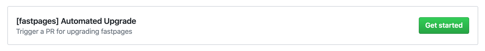
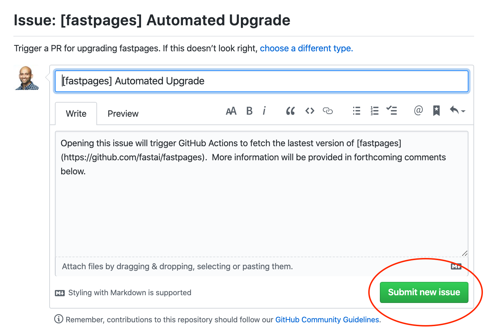
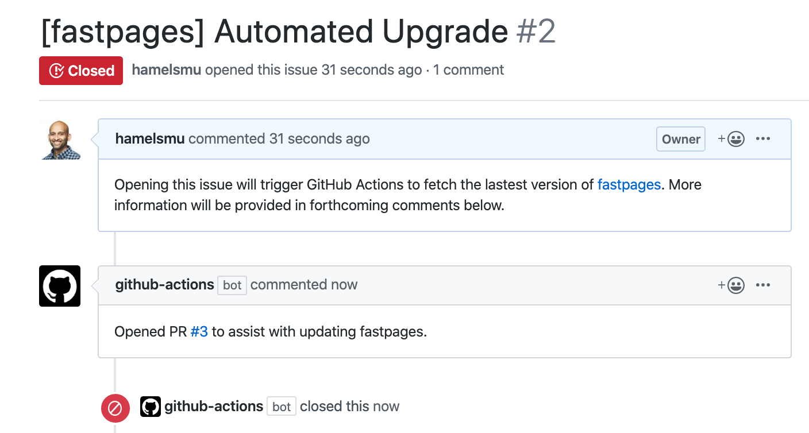

# Upgrading fastpages

<!-- TOC depthFrom:1 depthTo:6 withLinks:1 updateOnSave:1 orderedList:0 -->

- [Automated Upgrade](#automated-upgrade)
    - [Step 1: Open An Issue With The Upgrade Template.](#step-1-open-an-issue-with-the-upgrade-template)
    - [Step 2: Click `Submit new issue`](#step-2-click-submit-new-issue)
    - [Step 3: A Link to Pull Request Will Appaer](#step-3-a-link-to-pull-request-will-appaer)
    - [Step 4: Review & Merge PR](#step-4-review-merge-pr)
- [Manual Upgrade](#manual-upgrade)
    - [Easy Way (Recommended)](#easy-way-recommended)
    - [Advanced](#advanced)
- [Additional Resources](#additional-resources)
<!-- /TOC -->

There are two ways to upgrade fastpages.  One is an automated way that assumes you have made no changes to the styling or HTML of your site. Alternatively, you may [upgrade manually](#manual-upgrade) and determine which changes to accept or reject.  For most people we recommend upgrading fastpages automatically.

## Automated Upgrade

 - This method is appropriate for those who have not customized the styling or HTML of their site.  
 - **If you are unsure, try the Automated approach and review which files are changed in the automated PR** to see if this appropriate for you.

### Step 1: Open An Issue With The Upgrade Template.

- Open a new issue in your repository, and push the "Get Started" button for the `[fastpages] Automated Upgrade` Issue template, which looks like this:
    - **IF YOU DON'T SEE THIS**: you have an older version of fastpages and you **must [manually upgrade](#manual-upgrade) once** to get this new functionality.

    

### Step 2: Click `Submit new issue`

- Be careful not to change anything before clicking the button.

    

### Step 3: A Link to Pull Request Will Appaer

- This issue will trigger GitHub to open a PR making changes to your repository for the upgrade to take palce.  A comment with the link to the PR will be made in the issue, and will look like this:

    

    It is possible that you might receive an error message instead of this command.  You can follow the instructions in the comment to troubleshoot the issue.  Common reasons for receiving an error are:

    - You are up to date, therefore no upgrade is possible.  You will see an error that there is "nothing to commit".
    - You already have a PR from a prevoius upgrade open that you never merged.

    Please [ask on the forums](https://forums.fast.ai/) if you have encounter another problem that is unclear.

### Step 4: Review & Merge PR

- Ensure that you read the instructions in the PR carefully.  Furthermore, carefully review which files will be changed to determine if this interferes with any customizations you have mades to your site.  When ready, select `Merge pull request`.  
- If the PR is making undesired changes to files you can use the manual upgrade approach instead.

## Manual Upgrade

### Easy Way (Recommended)

Create a new repo with the current `fastpages` template by following the [setup instructions](https://github.com/fastai/fastpages#setup-instructions) in the README, and copy all of your blog posts from `_notebooks`, `_word`, and `_posts` into the new template.  This is very similar to what the automated process is doing.

### Advanced

- This method is appropriate for those who made customizations to the HTML or styling of fastpages.  
- You must proceed with caution, as new versions of fastpages may not be compatible with your customizations.
- You can use git to perform the upgrade by [following this approach](https://stackoverflow.com/questions/56577184/github-pull-changes-from-a-template-repository/56577320) instead.  A step-by-step companion to this stack overflow post with screenshots is [written up here](https://github.com/fastai/fastpages/issues/163#issuecomment-593766189).
- Be careful to not duplicate files, as files in fastpages have been reorganized several times.

## Additional Resources

- [This Actions workflow](/.github/workflows/upgrade.yaml) defines the automated upgrade process.
- You can get more help with upgrading in the [fastai forums - nbdev & blogging category](https://forums.fast.ai/c/fastai-users/nbdev/48).
